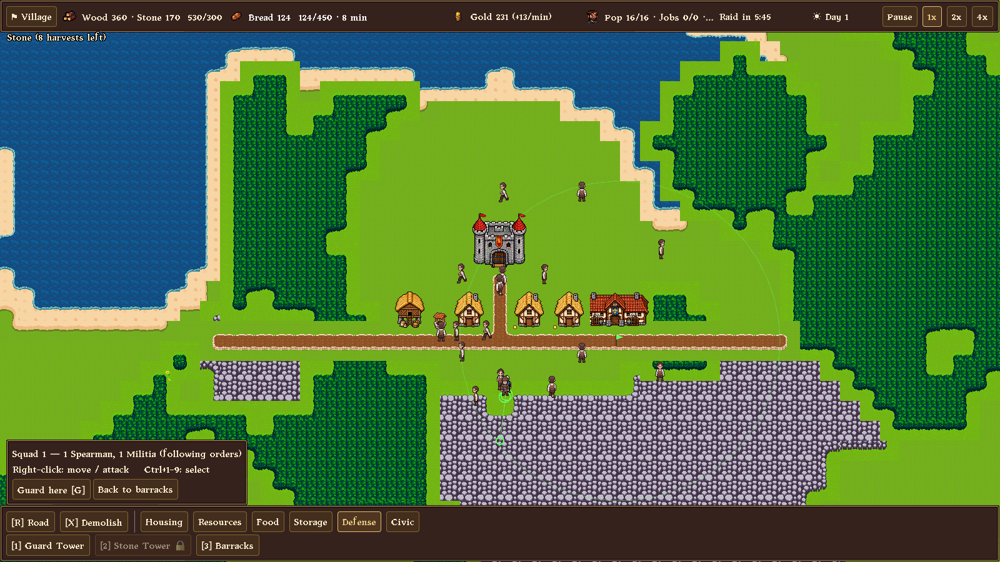
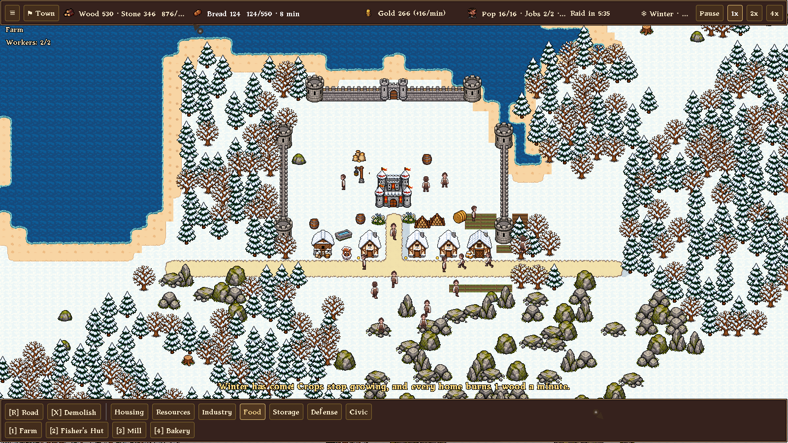
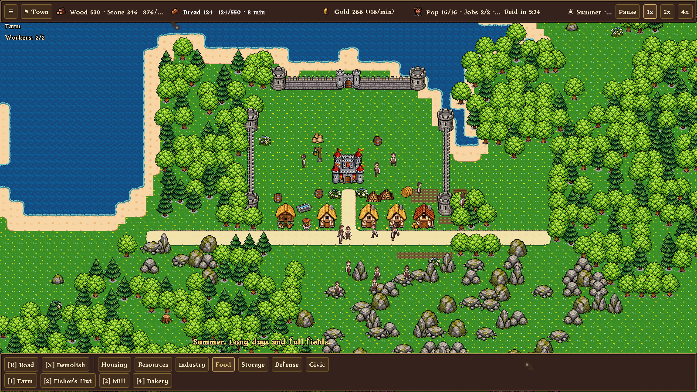
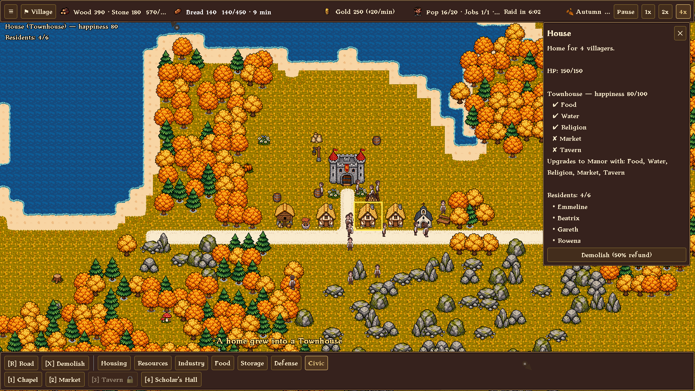
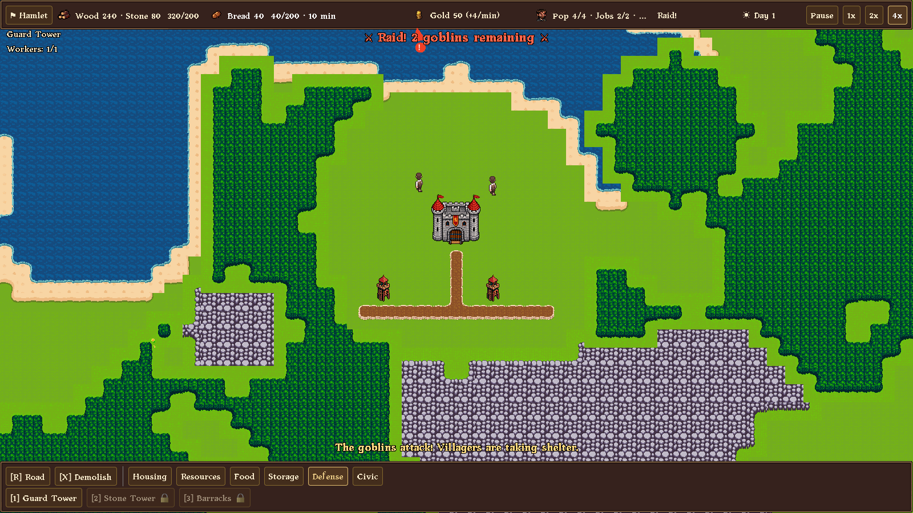
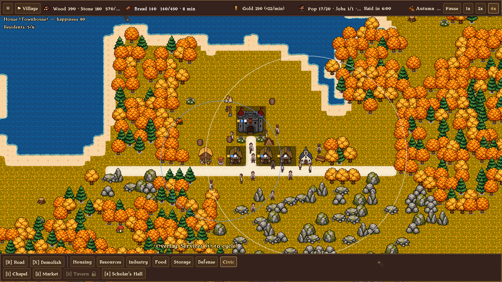
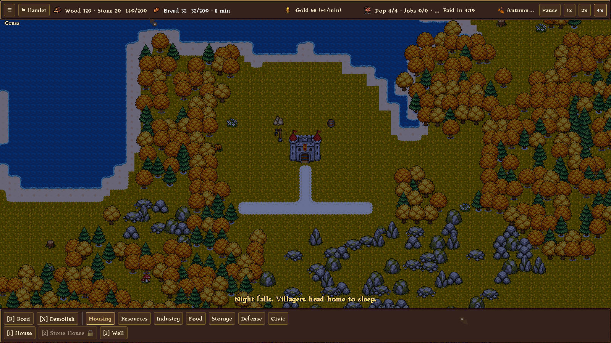

# Kingdom Legacy

**A medieval city builder where every villager is a real person hauling real goods, and goblins come to take them.**

Grow a hamlet into a kingdom. Lay roads, build farms, mills and bakeries, keep
your people fed, housed and happy, then train an army and raise towers before
the next raid hits. Made with Godot 4.



> **Status: playable, start to finish.** Milestones M0–M8 are done: economy,
> raids, troops, tiers, research, needs, day/night, pixel art, walls, fire,
> the war economy, a main menu, tutorial hints, the Dragon's final siege,
> save/load, and a seasonal art direction (M9). See the [roadmap](roadmap.txt).

## Features

- **A living town.** Every villager is an agent with a home and a job. You can
  watch them chop trees, harvest wheat, carry flour from the mill to the bakery
  and haul goods to storage. When there's a bottleneck, you can see it.
- **Supply chains.** Woodcutters, quarries, fishers, and farms that till and
  harvest their own fields. Wheat goes to the mill, flour to the bakery, bread
  to the granary. Goods sit in specific buildings, and haulers from a Carter's
  Yard keep them moving.
- **Needs and happiness.** Homes need food, water, religion, a market and a
  tavern. Cover them with Wells, Chapels, Markets and Taverns, and cottages grow
  into townhouses and manors that hold more people and pay more tax. Set the tax
  rate on the Keep and trade gold for happiness.
- **Monster raids.** Goblins arrive every few minutes from a direction the game
  announces. Thieves loot the storehouse they reach and run, and brutes smash
  buildings. Later come orcs who set fires, shamans who heal them, wolf riders
  who hit outlying farms, and trolls that smash through walls. Villagers hide
  when raiders get close. Lose the Keep and the game is over.
- **A war economy.** Iron mines feed a smithy and an armory; spearmen and
  archers need weapons, knights need weapons and armor. Goblin lairs out in
  the wilds make every raid bigger until you march a squad out and burn them
  down. In a pinch, sound the Call to Arms and villagers fight with
  pitchforks.
- **Walls and fire.** Drag palisades and stone walls around the town and put
  gates where your roads cross them. Raiders have to break through. Fire
  spreads between wooden buildings unless a Well is close enough to put it
  out.
- **Hybrid combat.** Guard towers shoot on their own. Barracks train militia,
  spearmen and archers into squads that defend automatically. Select a squad
  whenever you want to send it somewhere, then let it go back to guarding.
- **Progression.** Grow from Hamlet to Village, Town, City and Kingdom. Each
  tier unlocks buildings, units and research, and upgrades the Keep into a
  Castle and then a Citadel. The raids grow with you.
- **Day and night.** At dusk the town goes quiet as villagers head home to
  sleep. Guards stay on watch.
- **Seasons.** The year turns from autumn to winter, spring and summer, and
  the whole map changes with it: golden leaves, then snow on every roof. In
  winter the fields freeze and every home burns firewood.
- **Merchants and trade.** Build a Trading Post and travelling merchants
  come to town: sell your surplus for gold, buy what your map lacks. Each
  merchant has a specialty and a limited purse.
- **Rivers and bridges.** A river winds past every town, with a couple of
  shallow fords. Drag a road across it to build a bridge, then guard the
  crossing: raiders use bridges too.
- **Streets that matter.** Upgrade dirt roads to cobblestone and paved
  streets for faster travel and a finer town; crowded roads slow down (see
  the Traffic overlay), and manors want a paved street at the door.
- **Goods for every class.** Cottages want ale, townhouses tools and
  cloth, manors wine and fine clothes, delivered by the market. Brew ale,
  forge tools, raise sheep, weave cloth, tailor fine clothes, grow grapes
  and press wine, or buy luxuries from the cloth & wine merchant.
- **Peasants, burghers and nobles.** As homes grow from cottages to
  townhouses to manors, burghers and nobles move in. Skilled trades need
  burghers, scholars and clergy need nobles, and knights need a noble
  captain; apprentices fill in (slower) until they arrive.
- **Town planning.** Pave plazas, plant gardens and flowerbeds, raise
  fountains, statues and a monument to your ruler. Every street has a
  desirability: industry drags it down, beauty lifts it, and only pleasant
  quarters grow Manors. Press O for the desirability map.
- **A living kingdom.** Children play in the lanes, townsfolk with baskets
  crowd the market and stop to chat, dogs trot after their owners,
  chickens scratch and sheep graze by the farms, birds cross the sky,
  chimneys smoke and windows glow at night.
- **A royal family.** A ruling house lives in the castle and strolls its
  grounds. The ruler's traits shape the realm (Just, Greedy, Builder,
  Warlike, Wise, Thrifty); rulers age and die, heirs inherit, and a ruler
  who dies without an heir plunges the realm into a succession crisis.
  Let raiders break into the castle and they loot the treasury and may
  kill a royal.
- **Villagers at work.** Woodcutters swing axes, miners pickaxes, farmers
  hoes, builders hammers; porters carry crates and stoop to pick up and put
  down their loads.
- **A castle that grows.** The Keep stands in reserved grounds at the
  heart of the map. At Town and again at Kingdom you can raise it into a
  Castle and then a Citadel: builders haul stone, wood and iron to the
  scaffolded site and build it, and each stage is bigger and stronger.
- **Foresters.** Woods no longer run out for good: a Forester's Lodge
  plants saplings that grow into forest, and cleared woodland slowly grows
  back from its edges.
- **Settings.** Volume per channel, fullscreen, interface scale, autosave
  interval, camera speed, edge scrolling, and an option to pause when
  raiders are sighted. Esc opens the menu.
- **Sound and music.** Axes, pickaxes, hammers, a raid horn, arrows, a
  dragon's roar, birdsong by day and crickets at night, plus music for the
  title, day, night, winter, raids and the Dragon's siege, all synthesized
  and composed in code. Volume sliders are on the title screen and in the ☰
  menu.
- **Procedural maps.** Every game is a new 128×128 map. Pass a seed to replay
  one.

## Screenshots

| | |
|---|---|
|  |  |
| **Winter.** Snow on every roof; fields stop growing and homes burn firewood. | **Summer.** The same town a few seasons later. |
|  |  |
| **Needs.** A Chapel turned this home into a Townhouse. A market and a tavern would make it a Manor. | **Raids.** Manned guard towers wait for 2 goblins; the red arrow points at them off-screen. |
|  |  |
| **Overlays.** Press O to see which homes a well and a chapel cover. | **Night.** The villagers are asleep and the town is empty until morning. |

## Getting started

**Requirements:** [Godot 4.7](https://godotengine.org/download) (standard
build; no .NET needed).

```bash
git clone https://github.com/weilonprice/kingdom-legacy.git
```

1. Open the Godot Project Manager, click **Import**, and select
   `kingdom-legacy/project.godot`.
2. Press **F5** to play. The title screen takes an optional map seed, a
   difficulty, a map size and whether to show tutorial hints, and offers
   **Continue** once you have a save.

To skip the menu and replay a specific map, run the game scene from a
terminal with a seed:

```bash
godot --path kingdom-legacy res://scenes/main.tscn -- --seed=12345
```

### Your first few minutes

1. Four settlers live in the **Keep**. Press **1** (House) and place homes
   along the road, with their yellow entrance square on the road.
2. Open the **Resources** tab and build a **Woodcutter** next to the forest
   and a **Quarry** next to the rocks. Unemployed villagers take the jobs.
3. Open the **Food** tab. A **Fisher's Hut** by the water feeds people quickly;
   **Farm → Mill → Bakery** feeds more of them in the long run.
4. Build a **Well** and a **Granary** to reach **Village**. Press **T** to see
   what the next tier needs.
5. The first raid comes at about 7 minutes. Put a couple of **Guard Towers**
   near your storage, and later a **Barracks**.
6. To win, grow to **Kingdom**. That wakes the **Dragon**, whose siege
   comes three minutes later. Only towers and archers can hit it in the air;
   it lands every so often, and that's when your knights can strike.

## Controls

| Action | Input |
|---|---|
| Pan / zoom | WASD or arrow keys, middle-mouse drag / mouse wheel |
| Build | Category tabs at the bottom (**Tab** cycles), **1–9** picks a building |
| Road / Demolish | **R** (drag to lay; across water it builds a bridge) / **X** |
| Inspect a building | Left-click |
| Cancel / deselect | Right-click / **Esc** |
| Select a squad | Click a troop, drag a box, or **Ctrl+1–9** |
| Order a squad | Right-click the ground (move) or a raider (attack) |
| Squad back to guarding | **G** |
| Tier progress | **T** |
| Minimap on/off (click it to look around) | **M** |
| Map overlays (happiness, services, roads) | **O** |
| Tax rate | Click the Keep |
| Pause / speed | **Space** / top-bar buttons |
| Call to Arms during a raid | **C** or the button under the raid banner |
| Save / load | **F5** / **F8**, or the **☰** menu (also autosaves after every raid) |
| Call a raid now (testing) | **F9** |

## Project layout

```
scenes/main.tscn          Entry scene
scripts/
  data/                   Data tables: buildings, items, units, enemies, tiers, research, needs
  world/                  Map generation, terrain, buildings, pathfinding
  agents/                 Villagers, raiders, troops
  systems/                Citizens, raids, military, needs, research, tiers, storage, day/night
  controllers/            Camera, build tools, unit control
  ui/                     HUD, panels, overlays
assets/                   PixelLab art: buildings, terrain tilesets, characters, UI
  scripts/art/            Art loader (falls back to placeholder shapes if a file is missing)
tools/verify/             Real-input verification harness
design.txt                Game design outline
roadmap.txt               Milestones M0–M8
```

Most content is data-driven. A new building is mostly a new entry in
`scripts/data/building_defs.gd`.

## Development

### Verifying changes

`tools/verify/` plays the real game with injected mouse and keyboard input and
records screenshots, state snapshots and a pass/fail report:

```bash
tools/verify/doctor.sh                                   # is the checkout healthy?
tools/verify/run.sh tools/verify/scenarios/squads.json   # plays a scenario
tools/verify/cleanup.sh                                  # stops leftover instances
```

There are scenarios for building, raids, squads, tiers and research, needs,
hauling, day/night, walls/fire/sieges, the war economy, the final siege,
tutorial hints and save/load, plus a title-screen check and a benchmark:

```bash
godot --headless --path . res://tools/verify/menu_check.tscn
godot --headless --path . res://tools/verify/bench.tscn -- --villagers=300 --enemies=120
```

Add `--headless` to `run.sh` to run without a window. Evidence goes
to `.verify-evidence/`. The scenario format is in
[`tools/verify/README.md`](tools/verify/README.md), and the agent guide and
feature map are in `.claude/skills/verify-kingdom-legacy/`.

### Balance autoplayer

`tools/autoplay/run.sh --seeds 12345,7 --minutes 90` plays whole games with a
rule-abiding bot and writes timelines to `.autoplay/`. See
[`tools/autoplay/README.md`](tools/autoplay/README.md).

### Building a release

`export_presets.cfg` has macOS (universal .zip) and Windows (.exe) presets.
Install Godot's export templates once (Editor → Manage Export Templates →
Download), then:

```bash
godot --headless --path . --export-release "macOS" builds/macos/KingdomLegacy.zip
godot --headless --path . --export-release "Windows Desktop" builds/windows/KingdomLegacy.exe
```

### Workflow

Each milestone is developed on its own branch and merged through a pull request
after its scenarios pass.

## Roadmap

| Milestone | |
|---|---|
| M0–M1 | Map, roads, villagers, gathering, food chain ✅ |
| M2–M3 | Goblin raids, towers, troops and squads ✅ |
| M4–M5b | Tiers, research, needs, happiness, taxes, storage, haulers, day/night ✅ |
| M6 | Pixel-art pass: terrain, buildings, animated characters, HUD theme ✅ |
| M7a | Walls, gates, fire, orcs, wolf riders and trolls ✅ |
| M7b | Iron, smithy and armory, knights, goblin lairs, wall towers, Call to Arms ✅ |
| M8a | Main menu, tutorial hints, the Dragon's final siege, victory ✅ |
| M8b | Save/load, map sizes, balance and performance passes, export presets ✅ |
| M9 | Art direction: autumn/winter/summer art, trees, props, castle walls, seasons ✅ |
| M10 | Rivers, fords and bridges ✅ |
| M11 | Sound effects, ambience, volume settings, minimap ✅ |
| M12–M16 | Balance autoplayer and three balance rounds ✅ |
| M17 | Grain storage, music ✅ |
| M18 | Merchants and trade ✅ |
| M19 | Settings menu ✅ |
| M20 | Forester and forest regrowth ✅ |
| M21 | Camera: trackpad pinch and pan, zoom keys and buttons, whole-map view ✅ |
| M29 | Public services: bathhouse & physician against sickness, fire brigade, town watch against thieves, schools that speed research ✅ |
| M28 | Roads: cobblestone and paved streets, traffic and a traffic overlay; Manors need a paved street ✅ |
| M27b | Goods: ale, tools, cloth, wine and fine clothes from seven new workshops and farms; homes want better goods as they rise ✅ |
| M27a | Peasants, burghers and nobles: classes from homes, jobs by class, noble captains, new townhouse and manor art ✅ |
| M26 | Beauty & desirability: plazas, fountains, gardens, trees, statues, a monument to your ruler; Manors need a pleasant quarter ✅ |
| M25 | A living kingdom: children, townsfolk and dogs, farm animals and birds, chimney smoke, glowing windows, handcarts ✅ |
| M24 | Walls that gate roads, cost preview, stone upgrades; a 250-person kingdom; challenge the Dragon when ready ✅ |
| M23 | The royal family (ruler, spouse, heir with traits, aging and succession) and the treasury raiders can break into ✅ |
| M23a | Villager animations: chopping, mining, farming, hammering, carrying, picking up and putting down ✅ |
| M22 | The growing castle: Keep 5×5 → Castle 7×7 → Citadel 9×9, built by builders in reserved grounds ✅ |
| M30 | **Great works** (planned): Cathedral, Guildhall, University, Grand Market Square. See design.txt §18 |
| later | People's lives, stats & graphs. See design.txt §17–18 |

Details are in [roadmap.txt](roadmap.txt) and [design.txt](design.txt).

## Credits

- Built with [Godot Engine](https://godotengine.org).
- Pixel art, the pixel font and the UI panels were generated with
  [PixelLab](https://pixellab.ai). See [the art style test](docs/style_test.png).
